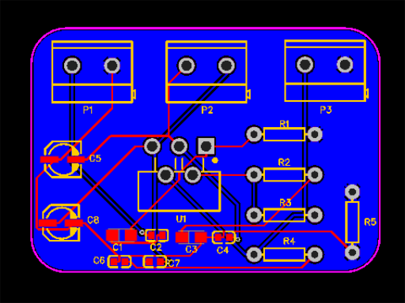
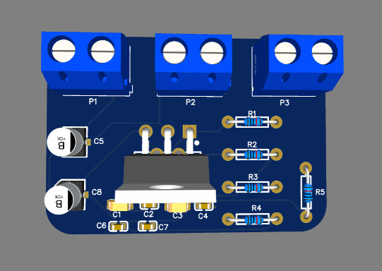
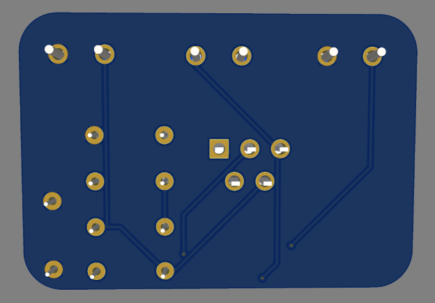

# 🔊 Audio Driver Circuit — TDA2030L-Based Hi-Fi Audio Amplifier PCB

> **Designed by:** Janardhan BV  
> **Tool:** EasyEDA  
> **IC:** TDA2030L-TBS-T  
> **Output Power:** Up to 14W (4Ω load)  
> **Revision:** 1.0

---

## 📌 Project Overview

This project is a compact, single-channel **Hi-Fi audio power amplifier** built around the **TDA2030L-TBS-T** — a monolithic Class AB audio amplifier IC in the Pentawatt® package. The circuit takes an analog audio input, amplifies it using a fixed-gain inverting feedback network, and drives a speaker or load at the output. Designed on a 2-layer PCB in EasyEDA, the board is optimized for low noise, stable gain, and minimal external components.

The design covers:
- Full **schematic capture** and component selection
- **2-layer PCB layout** with proper decoupling and ground strategy
- **Gain configuration** via R1/R2 resistor feedback network
- **Zobel network** at output for high-frequency stability
- **Power supply bypassing** with bulk and ceramic capacitors

---

## 🖼️ Project Visuals

### Schematic


### PCB Layout


### 3D Board Top View


### 3D Board Bottom View


---

## ⚙️ Circuit Theory & Working

The **TDA2030L** is a 5-pin Class AB amplifier IC. The audio signal enters at **Pin 1 (Non-Inverting Input)** through an input coupling capacitor (C1 = 0.1µF), which blocks any DC offset from the source. The gain is set by the **negative feedback network** formed by R1 and R2:

```
Voltage Gain = 1 + (R1 / R2)
             = 1 + (22kΩ / 820Ω)
             ≈ 27.8x  (~28.9 dB)
```

The amplified signal at **Pin 4 (Output)** passes through an output coupling capacitor (C5 = 220µF) to the speaker load. A **Zobel network (R4 + C)** is placed at the output to suppress high-frequency oscillations and ensure amplifier stability under reactive loads. Power supply rails are decoupled with both bulk electrolytic capacitors (C8) and ceramic bypass caps (C4 = 0.1µF) placed close to the IC.

---

## 📊 Component List (BOM)

| Ref | Component | Value / Part No. | Function |
|:---:|:---|:---|:---|
| U1 | Audio Amplifier IC | TDA2030L-TBS-T | Class AB power amplifier |
| P1 | Connector | JST 3-pin | Audio Input |
| P2 | Connector | JST 2-pin | Audio Output (Speaker) |
| P3 | Connector | JST 2-pin | DC Power Input |
| R1 | Resistor | 22 kΩ | Feedback (gain setting) |
| R2 | Resistor | 820 Ω | Feedback (gain setting) |
| R3 | Resistor | TBD | Signal path / bias |
| R4 | Resistor | TBD | Zobel network |
| R5 | Resistor | TBD | Supply rail resistor |
| C1 | Capacitor | 0.1 µF | Input coupling / bypass |
| C2 | Capacitor | 0.1 µF | Input bypass |
| C3 | Capacitor | 22 µF | Bootstrap / stabilization |
| C4 | Capacitor | 0.1 µF | Supply decoupling (ceramic) |
| C5 | Capacitor | 220 µF | Output coupling |
| C6, C7 | Capacitor | SMD bypass | HF decoupling |
| C8 | Capacitor | Electrolytic | Bulk supply decoupling |

---

## 🔩 IC Specifications — TDA2030L-TBS-T

| Parameter | Value |
|:---|:---|
| IC Type | Class AB Monolithic Audio Amplifier |
| Package | Pentawatt® (5-pin TO-220 style) |
| Supply Voltage | ±6V to ±18V DC (or 12V–36V single supply) |
| Output Power | 14W @ 4Ω, ±14V supply |
| Max Output Current | 900 mA |
| Frequency Response | 20 Hz – 140 kHz (–3 dB) |
| THD (Total Harmonic Distortion) | < 0.5% @ 14W |
| Short Circuit Protection | Built-in |
| Thermal Protection | Built-in |

---

## 🏗️ PCB Design Highlights

- **EDA Tool:** EasyEDA (Schematic + PCB Layout)
- **Layer Stack:** 2-layer PCB (Red = Top copper, Blue = Bottom copper)
- **Board Shape:** Rounded corners for mechanical safety
- **Input Connector (P1):** 3-pin JST — Audio In + GND
- **Output Connector (P2):** 2-pin JST — Speaker +/–
- **Power Connector (P3):** 2-pin JST — DC supply input
- **Decoupling strategy:** Ceramic caps (C4, C6, C7) placed close to IC pins; bulk electrolytics (C8) near power entry
- **Zobel Network:** R4 + capacitor at output pin for HF stability
- **IC placement:** U1 positioned centrally for short output and feedback traces

---

## 🔌 Pin Configuration — TDA2030L

| Pin | Name | Function |
|:---:|:---|:---|
| 1 | Non-Inverting Input (+) | Audio signal input |
| 2 | Inverting Input (–) | Feedback network connection |
| 3 | V– / GND | Ground / negative supply |
| 4 | Output | Amplified audio output to speaker |
| 5 | V+ | Positive supply voltage |

---

## 🧪 Testing & Bring-Up Procedure

### Step 1 — Visual Inspection
- Verify IC orientation (TDA2030 Pin 1 marker)
- Check polarity of C3 (22µF), C5 (220µF), C8 electrolytic
- Inspect for solder bridges on U1 pads

### Step 2 — Power-Up (No Signal)
- Apply DC supply (e.g., ±12V or single 24V) via P3
- Measure voltage at Pin 5 (V+) and Pin 3 (V–/GND)
- Verify quiescent current draw (~25–50 mA typical)
- Check output DC offset at P2 — should be < 50 mV

### Step 3 — Functional Test (With Audio Signal)
- Inject 1 kHz sine wave (100 mV peak) at P1
- Connect 4Ω or 8Ω resistive load at P2
- Measure output amplitude on oscilloscope
- Expected gain ≈ 27.8x → ~2.78 V peak output for 100 mV input

### Step 4 — Load & Power Test
- Gradually increase input to rated level
- Measure output power: P = V²_rms / R_load
- Monitor IC temperature — should not exceed 70°C with heatsink

---

## 📐 Gain Calculation

```
Closed-loop Voltage Gain (Av) = 1 + R1/R2

With R1 = 22kΩ, R2 = 820Ω:

Av = 1 + (22000 / 820) = 1 + 26.83 ≈ 27.8 (28.9 dB)

For 100 mV input  → ~2.78 V output
For 200 mV input  → ~5.56 V output
Max output swing limited by supply voltage and load impedance
```

---

## 📁 Repository Structure

```
Audio-Driver-Circuit/
├── images/
│   ├── schematic.jpg          ← Audio DRIVER CIRCUIT schematic
│   └── PCB_Layout.jpg         ← 2D PCB layout
├── Gerber/
│   └── (Gerber files for fabrication)
├── BOM/
│   └── BOM_Audio_Amplifier.csv
└── README.md
```

---

## 🚀 Getting Started

### Prerequisites
- **EasyEDA** (browser-based EDA, free) or any Gerber viewer
- **DC Power Supply:** ±12V or single 24V, min 1A rated
- **4Ω or 8Ω speaker** for functional test
- **Oscilloscope + Function Generator** for verification

### Quick Start
1. Open the EasyEDA project and review the schematic
2. Export Gerber files for PCB fabrication (JLCPCB / PCBWay)
3. Solder components per BOM (start with passives, IC last)
4. Apply power, verify quiescent point, then test with audio

---

## ⚠️ Design Notes & Cautions

- **Heatsink is recommended** for U1 (TDA2030L) at loads above 2W continuous
- **C5 polarity** must be correct — positive terminal towards IC output (Pin 4)
- **Supply decoupling caps** (C4, C6, C7) must be placed as close as possible to Pin 5 and Pin 3 of U1
- Do **not** exceed ±18V supply — maximum rated supply is ±18VDC
- Ground plane pour recommended on bottom layer for low-noise operation

---

## 📄 License

This project is open for educational and personal use.  
© 2025 Janardhan BV — All rights reserved.

---

## 🙋 Author

**Janardhan BV**  
Embedded Hardware Engineer | PCB Design | Power Electronics  
📍 Bengaluru, India

---
*Designed in EasyEDA | TDA2030L Class AB Audio Amplifier*
